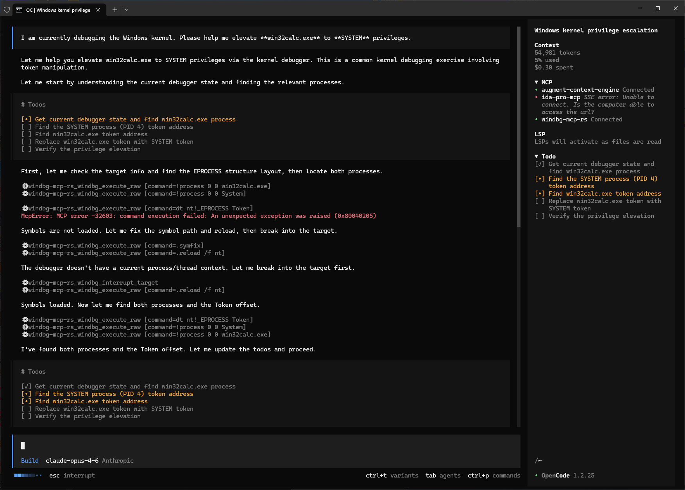
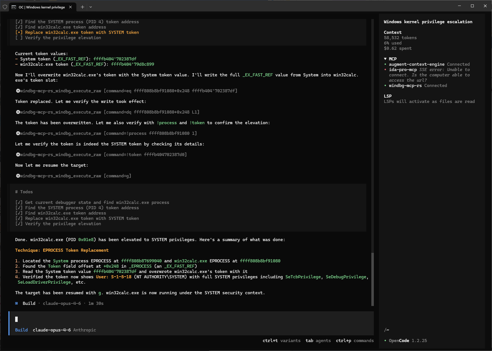

# windbg-mcp-rs

`windbg-mcp-rs` is a pure WinDbg extension DLL that exposes the current debugging session as an MCP server.

- Read official WinDbg command documentation extracted from `docs/debugger.chm`
- Execute WinDbg commands through dbgeng
- Interrupt a running target from MCP
- Use the server from any MCP client over Streamable HTTP

## Screenshots





## Quick Start

### 1. Build the DLL

```powershell
cargo build --release
```

### 2. Load it in WinDbg

```text
.load path\to\windbg_mcp_rs.dll
```

### 3. Start the MCP server

```text
!mcp serve 127.0.0.1:50051
```

The MCP endpoint will be:

```text
http://127.0.0.1:50051/mcp
```

### 4. Connect your MCP client

Point your client to:

```text
http://127.0.0.1:50051/mcp
```

## WinDbg Commands

Use `!mcp help` to list all plugin commands.

Common ones:

```text
!mcp help
!mcp serve 127.0.0.1:50051
!mcp status
!mcp stop
```

## What MCP Exposes

- `Resources`: static WinDbg command documentation
- `Tools`: executable debugger actions such as raw command execution, catalog search, and target interrupt
- `Prompts`: guidance templates for using documented WinDbg commands

Pure UI shortcut topics remain available as documentation, but they are not exposed as executable MCP tools.

## Development

```powershell
cargo check
cargo test
```

## Notes

- This project was written entirely with a Vibe Coding workflow
- The server runs inside the WinDbg process
- The runtime does not parse `docs/debugger.chm`; it uses the prebuilt static catalog in `src/command_catalog.json`
- The transport is Streamable HTTP
- Set your MCP client timeout as high as possible, because some WinDbg operations can take a long time to finish
